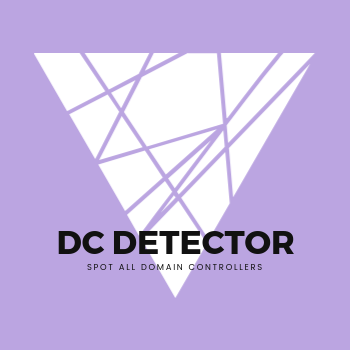

# DC Detector

[](https://badge.fury.io/rb/dcdetector)

[](https://github.com/noraj/dcdetector/network)
[](https://github.com/noraj/dcdetector/stargazers)
[](https://github.com/noraj/dcdetector/blob/master/LICENSE)
[](https://inventory.raw.pm/tools.html#DC%20Detector)

[](https://repology.org/project/dcdetector/versions)



> Spot all domain controllers in a Microsoft Active Directory environment.

**CLI**


**Library**


## Features

- CLI and library
- Find computer name, FQDN, and IP address(es) of all DCs

## Installation

```plaintext
$ gem install dcdetector
```

Check the [installation](https://noraj.github.io/dcdetector/TODO) page on the documentation to discover more methods.

## Documentation

Homepage / Documentation: https://noraj.github.io/dcdetector/

## Author

Made by Alexandre ZANNI ([@noraj](https://pwn.by/noraj/)).
